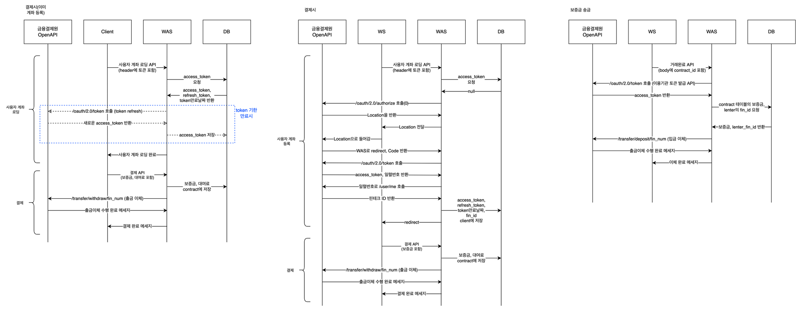

# Bill2Market
빌리마켓 웹 서비스 개발 프로젝트
## 프로젝트 한줄 소개
사용자간 중고물품을 사고 파는 것이 아닌 중고 대여 및 반납을 할 수 있는 플랫폼입니다. 
## 개발 기간
2022.03.07 ~ 2022.06.07
## 맴버구성
- **PM** - 1명
- **Architect** - 1명
- **Back-end** - 3명
- **Front-end** - 3명
- **QA / Tester** - 1명
## 사용 기술 및 라이브러리
- **Back-end** - `Spring Boot` , `MariaDB` , `JPA` , `Java`
- **Frond-end** - `React`
- **Cloud** - `ELB` , `EC2` , `ElastiCache(Redis)` , `OpenSearch(ElasticSearch)` 

## 상세 내용
- **Architecture** 


- **ERD** 


```
빌리마켓은 일반적인 중고거래 플랫폼에서 벗어나 대여, 반납을 할 수 있는 플랫폼으로 사용자들에게 더 큰 편의성과 새로운 가치를 제공합니다. 
사용자들은 빌리마켓에서 내가 가지고 있지만 매일 사용하지는 않는 물건, 잠시 필요하지만 소유할 필요는 없는 물건들을 빌려주고 빌릴 수 있습니다.
빌리마켓의 기능으로는 물품 게시판, 찜 기능, 물품 검색, 실시간 채팅, 빌리페이(결제시스템)이 있습니다.
```

## 참여한 내용

### 1. Jira를 사용한 진척도 관리

```
Agile Process로 개발을 진행했습니다. 
매주 스프린트를 진행하여 한 주 동안 진행한 백로그를 데모해보고 이슈들을 체크했으며 다음 스프린트에 태울 백로그들을 결정하였습니다. 
또한 2~3일 간격의 스크럼을 통해 개발과정 중 나온 이슈들에 대해 자유로운 의견 공유를 하였습니다.
Jira를 사용하여 스프린트를 관리하고 진척도를 공유를 하였습니다. 
매주 평균적으로 3개의 백로그를 태워내며 10주 동안 빌리마켓을 개발하였습니다.
```

### 2. CI / CD 구축

```
Github Action과 AWS Code Deploy를 통해 CI/CD 환경을 구축하였습니다.
```

### 3. 아키텍쳐 설계 및 구축

```
WS, WAS, DB로 이루어진 3tier 아키텍쳐로 설계를 한 뒤에 이를 AWS를 사용하여 이중화하고 배포하였습니다.
WS와 WAS에 각각 Outer ELB와 Inner ELB를 배치해 트래픽을 분산시켰습니다.
전체 시스템을 VPC로 감쌌으며, WS는 프라이빗 서브넷, WAS와 DB는 퍼블릭 서브넷에 배치해 외부에서 WAS와 DB로의 접근이 불가능 하도록 하여 보안성을 높였습니다.
```

### 4. Naver API를 사용한 SNS 로그인 기능 구현
```
Naver API를 사용하여 로그인을 하면 빌리마켓 시스템의 JWT토큰을 발급 받아 API를 사용할 수 있도록 SNS 로그인 기능을 구현하였습니다.
```

### 5. 주변물품 탐색기능을 위한 MariaDB 함수 사용형상 설계

```
빌리마켓은 물품과 사용자의 현재 위치사이의 거리를 계산하여 사용자의 반경 6KM 내의 물건들만 메인화면에서 출력되도록 했습니다.
이때, WAS에서 물품과 사용자의 거리를 계산하여 데이터를 웹서버에 전송하는 방식을 사용할 경우 
DB사이와 WAS사이에 너무 많은 양의 데이터가 이동해 서버에 과부화가 생길 수 있으므로, 
저희는 MariaDB에서 제공하는 ST_DISTANCE_SPHERE함수를 사용하여 DB에서 부터 거리를 계산하고 WAS에는 필요한 데이터만 전송하도록 하여 시스템의 성능을 높였습니다.
```

### 6. Elasticsearch 사용형상 설계

```
사용자의 편의성을 높이기 위해 검색창에 검색시 키워드를 통해 데이터를 불러올 수 있도록 오픈소스 검색엔진인 ElasticSearch를 사용했습니다. 
또한 Logstash 주기적으로 DB의 데이터를 추출하여 키워드와 매핑 후 ElasticSearch에 저장하도록 Elasticsearch의 사용형상을 설계했습니다.
```

### 7. 웹소켓과 STOMP를 사용한 실시간 채팅 기능 API 설계 및 구현
```
웹소켓을 사용하여 실시간 채팅이 가능하도록 하였으며, 다양한 채팅방에 참여할 수 있도록 구독 방식을 사용하는 STOMP를 사용하였습니다.
서버를 이중화 했기 때문에 두 WAS사이에 채팅과 구독에 대한 정보를 공유하기 위해 서버 캐시로 Redis를 사용하였습니다.
```

### 8. 금융결제원 OPEN API를 사용한 빌리페이 기능 API 설계 및 구현

```
고객들이 대여료와 보증금을 저희 서비스를 통해 안전하게 주고 받을 수 있도록 빌리페이 기능을 구현했습니다. 
빌리페이 기능을 구현하는 데는 금융결제원의 OPEN API가 사용됐습니다.
사용자가 저희 서비스를 통해 금융결제원에 본인의 계좌를 등록하고 빌리페이 계좌로 보증금과 대여료를 전송하게 되면, 
반납완료가 됐을 때 빌리는 사람에게 보증금, 빌려주는 사람에게 대여료를 빌리페이 계좌에서 자동으로 송금하도록 하였습니다.
```


